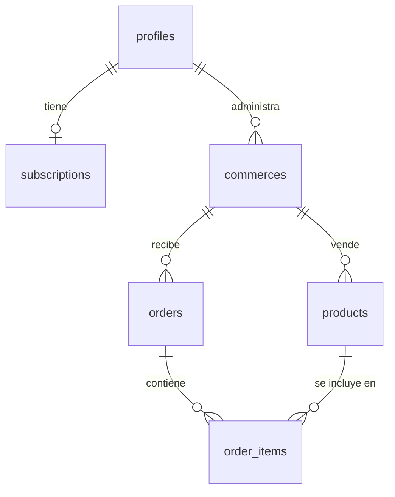

# Baki.lat - Ficha Técnica y Documentación del Proyecto (MVP 1.0)

Baki es una plataforma de comercio ágil diseñada para permitir a pequeños comercios y emprendedores en Latinoamérica crear su catálogo digital optimizado para dispositivos móviles en cuestión de segundos, gestionar su inventario y canalizar sus ventas directamente hacia WhatsApp.

---

## 1. Arquitectura de la Base de Datos (Supabase / Postgres)

El modelo de datos está diseñado bajo una arquitectura relacional sólida con Row Level Security (RLS) habilitado para garantizar la seguridad de la información.



### Tablas del Sistema
1. **`public.profiles`**: Almacena los perfiles de usuario.
   * `id` (uuid, PK): ID del usuario de autenticación (`auth.users`).
   * `username` (text, unique): Nombre de usuario del panel (ej: `@jesus-fdz`).
   * `full_name` (text), `avatar_url` (text), `email` (text).
2. **`public.subscriptions`**: Gestiona los planes del usuario.
   * `id` (uuid, PK), `profile_id` (uuid, FK -> profiles).
   * `plan_type` (text): `free` (máx 20 productos activos, 100 totales) o `premium`.
   * `status` (text): `active`, `trialing`, `canceled`.
3. **`public.commerces`**: Registra los comercios del usuario.
   * `id` (uuid, PK), `profile_id` (uuid, FK -> profiles).
   * `name` (text): Nombre del comercio.
   * `slug` (text, unique): Identificador de la tienda en URL (ej: `dk-store`).
   * `whatsapp_number` (text): Número de teléfono para recibir compras.
   * `currency` (text): Moneda elegida (PEN, COP, USD, ARS, CLP).
   * `cover_image_url` (text): Banner de fondo del catálogo.
4. **`public.products`**: Catálogo de artículos de venta.
   * `id` (uuid, PK), `commerce_id` (uuid, FK -> commerces).
   * `name` (text), `description` (text), `price` (numeric).
   * `image_url` (text): Imagen de exhibición del producto.
   * `product_code` (text): SKU correlativo auto-generado (ej: `REF-1001`).
   * `is_active` (boolean): Controla si está visible en el catálogo público.
   * `is_deleted` (boolean): Soft-delete de inventario.
5. **`public.orders`** & **`public.order_items`**: Estructura de ventas preparada para futuros módulos de analítica y facturación.

### Triggers y Automatizaciones SQL
* **`assign_product_code`**: Trigger en `BEFORE INSERT ON public.products` que calcula el número correlativo por comercio y le asigna el prefijo correlativo `REF-1001`, `REF-1002`, etc., garantizando que el merchant identifique fácilmente qué producto le están ordenando por chat.

### Row Level Security (RLS)
* **Público:** Lectura de comercios y productos visibles (`is_active = true` e `is_deleted = false`).
* **Privado:** Inserción y modificación permitida únicamente al usuario dueño del registro mediante validaciones `auth.uid() = id` o subconsultas al ID del comercio del usuario logueado.

---

## 2. Flujo del Usuario y Módulos del MVP

### A. Autenticación y Registro
* **Login de un clic:** Acceso seguro con Google OAuth (`/auth/login`).
* **Onboarding Simplificado (`/auth/onboarding`):** Formulario directo que solicita:
  1. Nombre del Comercio (ej. *DK Store*).
  2. Celular/WhatsApp de Ventas (ej. *+51929735569*).
  3. Moneda de exhibición (PEN, COP, USD, ARS, CLP).
  * *Tolerancia a fallos:* Si el perfil del usuario no existiese por limpiezas de DDL, el flujo lo backfillea en segundo plano de manera automática.

### B. Panel Administrativo del Comercio (`/panel/[commerce-slug]`)
* **Listado de Productos (`/panel/[commerce]/products`):**
  * CRUD completo de productos con carga de imágenes a un bucket público de Supabase (`baki-media`).
  * Switch rápido de visibilidad (`is_active`) con validación de límite de plan gratis.
  * **Banner de Compartido Integrado:** Widget destacado con el enlace de la tienda, botón de copiar enlace al portapapeles, botón para previsualizar el catálogo público en una nueva pestaña y botón para compartir en WhatsApp con un texto de invitación personalizado.
* **Mi Tienda (`/panel/[commerce]/store`):**
  * Control del nombre, WhatsApp de contacto y la moneda.
  * Personalización del slug con formato limpio (ej: `@mi-comercio`).
  * Carga de imagen de portada (Banner).

### C. Catálogo Público Móvil (`/[commerce-slug]`)
* **Diseño Mobile-First:** Ancho máximo de 480px, optimizado para ser visualizado en teléfonos inteligentes mediante un look elegante en color oscuro y glassmorphism.
* **Buscador Interactivo:** Filtrado instantáneo de productos por coincidencia de nombre o descripción.
* **Flujo de Compra sin Fricción:** El cliente selecciona artículos y pulsa "Pedir por WhatsApp". El sistema lo redirecciona al WhatsApp del comercio con un mensaje pre-llenado estructurado por el código de referencia (ej: `REF-1001`), omitiendo los precios en el cuerpo del mensaje para permitir que el merchant concrete la negociación directamente.

---

## 3. Estructura del Código Fuente

El proyecto está construido usando **Next.js 16 (App Router)** y **Vite/Turbopack**.

```text
src/
├── app/
│   ├── (landing)/                  # Página promocional e informativa de Baki.lat
│   ├── [commerce]/                 # Catálogo público dinámico (ej: baki.lat/@dk-store)
│   │   ├── _components/            # Interfaz del catálogo y lógica de orden por WhatsApp
│   │   └── opengraph-image.tsx     # Generación dinámica de previsualizaciones SEO (OpenGraph)
│   ├── auth/                       # Flujos de Login, Callback y Onboarding de usuarios
│   ├── panel/                      # Dashboard privado
│   │   ├── [commerce]/             # Rutas dinámicas por tienda
│   │   │   ├── products/           # CRUD, Stats e interfaz de productos
│   │   │   └── store/              # Configuración y edición del comercio
│   │   └── _components/            # Sidebar dinámico con engranaje de configuración
│   └── globals.css                 # Diseño y colores del sistema (Baki Dark Theme)
├── lib/
│   └── supabase/                   # Configuración del cliente Supabase (Server / Client)
└── shared/                         # Componentes, iconos y layouts globales compartidos
```

---

## 4. Hoja de Ruta (Futuras Funcionalidades)

1. **Gestión de Órdenes e Historial (`orders` y `order_items`):**
   * Guardar la compra en base de datos al presionar el botón de WhatsApp.
   * Panel de órdenes pendientes, entregadas y canceladas.
2. **Módulo de Analíticas y Leads:**
   * Contador de visitas al catálogo público.
   * Conteo de clicks en el botón de pedir por WhatsApp.
   * Registro de clientes interesados (leads) para campañas de remarketing.
3. **Integración con IA Baki WhatsApp Bot (Estrategia Pro):**
   * Integración de un agente inteligente mediante WhatsApp API.
   * Búsqueda autónoma de productos usando la base de datos de Baki.
   * Sincronización automática de inventario a través del bot.
